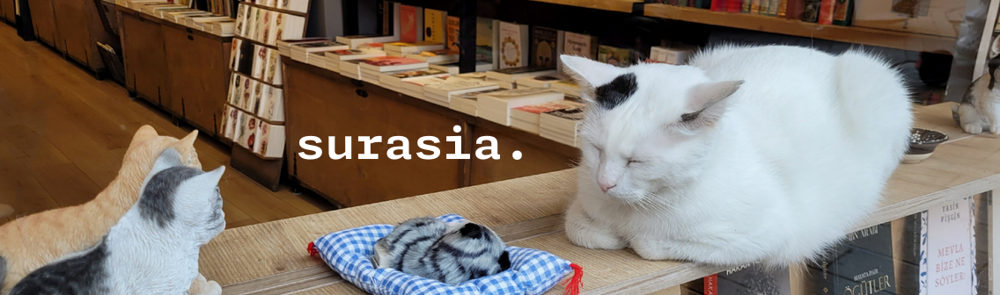

### 

## 🧾 About me :3

Hi! I'm Surasia, a self-taught 3D artist and beginner coder working on improving my skills on programming. I am currently in progress of reviving my old [Olympus](https://github.com/Surasia/Olympus) project, which is in dire need of a code refactor. I love cats, 3D Texturing and playing drums which I really have to pick up again. Besides that, I'm also a big fan of Halo and am working on some tools to interface with it's API, also reverse engineering the file formats it uses.

## 👨‍💻 Projects

- [Olympus (Reworking):](https://github.com/Surasia/Olympus) A tool based off of Coreforge's Blender Halo Infinite importer, made to import coatings, bitmaps and models from Halo Infinite.

- [InfiniteProjects:](https://github.com/Surasia/InfiniteProjects) Modification of Halo Infinite files to enable hidden gamemodes and maps.

- [UltimateMarkup:](https://github.com/Surasia/UltimateMarkup) Custom Game markup to add extra functionality to Halo Infinite.

... and others I'm still working on! This time not being related to Halo, I promise :D

## 📖 Skills/Languages

- [Blender:](https://blender.org) 3D Modeling, shading and plugin development.

- [Substance 3D (Painter/Designer):](https://www.adobe.com/products/substance3d-painter.html) Creating generators, smart materials and layered systems compatible with game engines.

- [Python:](https://python.org) Web framework development using Flask, building automated unit testing and creating GUIs using QT/tK.

